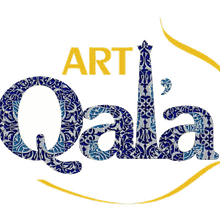
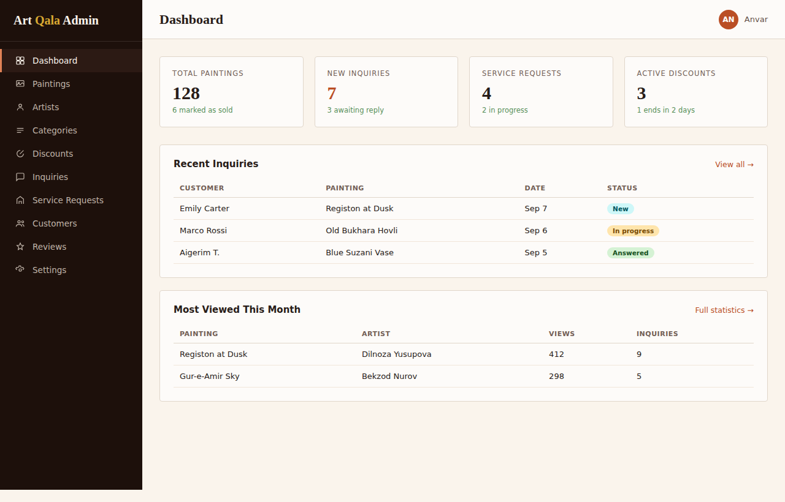
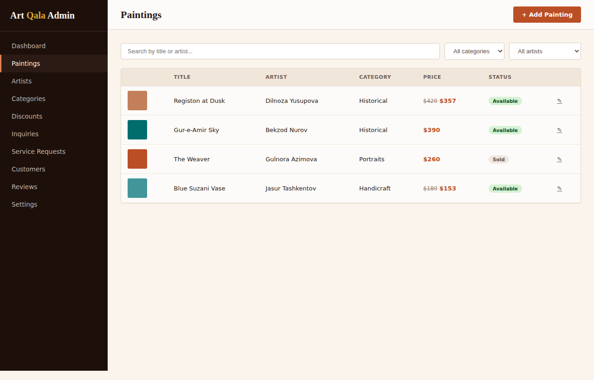
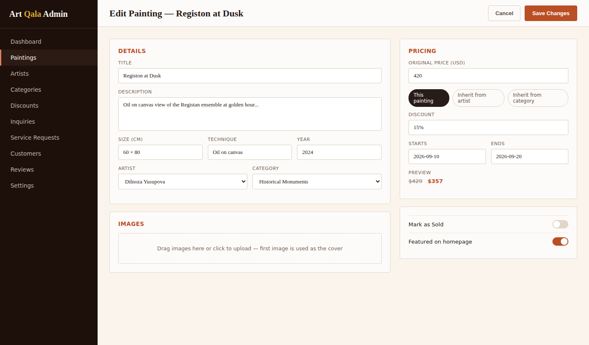
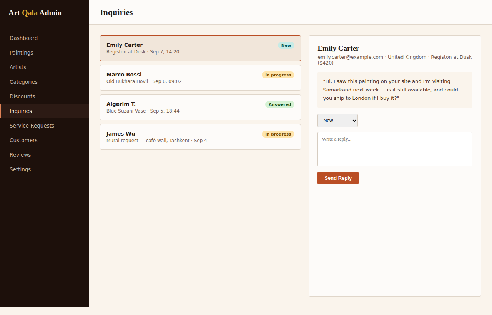

<p align="center">
  
</p>

<h1 align="center">Art Qala — Art Gallery Website</h1>

<p align="center">
  A modern, elegant, full-featured web platform for the <strong>"Art Qala"</strong> art gallery in Samarkand, Uzbekistan.
</p>

<p align="center">
  <a href="https://art-qala.vercel.app"></a>
  
  
  
  
  
  
</p>

<p align="center">
  <a href="https://art-qala.vercel.app"><strong>🔗 Live Demo</strong></a>
  &nbsp;·&nbsp;
  <a href="./README.md">🇺🇿 O'zbekcha</a>
</p>

This project was built according to the [AGENTS.md](./AGENTS.md) engineering rules and the [TZ/ArtQala_TZ.docx](./TZ/ArtQala_TZ.docx) requirements document.

---

## Table of Contents

- [Key Features](#key-features)
- [Screenshots](#screenshots)
- [Tech Stack](#tech-stack)
- [Getting Started](#getting-started)
- [Demo Accounts](#demo-accounts)
- [Deploying to Vercel](#deploying-to-vercel)
- [License](#license)

---

## Key Features

### Public Gallery
- **Night Gallery Hero**: Animated drifting ikat pattern, spotlight effect, floating Registan artwork, and a glowing gold headline.
- **Multilingual (i18n)**: English (**EN** — default), Russian (**RU**), Uzbek (**UZ** — Latin script only).
- **Currency Converter**: Live rates for **USD ($)**, **UZS (so'm)**, **RUB (₽)**, **EUR (€)**.
- **Gallery & Filters**: Browse by historical monuments, portraits, courtyards & homes, and handicraft themes, with search and price filters.
- **Painting Details**: Size, technique, year, certificate of authenticity, and a direct inquiry form to the curator.
- **Artist Directory**: Profiles and biographies of Samarkand's master artists, plus a portfolio-submission option.
- **Services**: Request-a-quote forms for murals, handcrafted ceramics, and custom commissioned paintings.
- **Contact**: Gallery address, hours, social links, and an animated interactive map with a geo-pin.
- **Certificate of Authenticity**: A print-ready certificate for every original painting sold, bearing the gallery's gold seal and the artist's/curator's signature.

### Accounts & Wishlist
- **Sign up & Sign in**: Name, country, email, and password.
- **Email OTP**: 6-digit verification code to activate an account.
- **Wishlist**: Works in-browser without an account, and syncs once signed in.
- **Customer Dashboard (`/account`)**: Inquiry status tracking (*Under Review, In Progress, Answered, Completed*), curator replies, saved artworks, and profile management.

### Admin Panel (`/admin`)
- **Design**: A clean management interface (`#1D100B` sidebar, `#FAF4EC` background).
- **Dashboard**: Key stats (paintings count, new inquiries, active promotions), recent inquiries, and most-viewed artworks.
- **Paintings CRUD**: Search, filters, adding new paintings, image uploads, price/discount management, and "Mark as Sold" / "Featured on homepage" toggles.
- **4-Tier Discount System**:
  1. *Painting-specific discount* (highest priority)
  2. *Artist-wide discount*
  3. *Category-wide discount*
  4. *Site-wide discount* (lowest priority)
  With automatic start/end date scheduling.
- **Inquiries**: A two-column management view for replying to customers and updating status.
- **Service Requests**: Mural and ceramics order list with curator notes.
- **Customer & review moderation**.

---

## Screenshots

<p align="center">
  
  
</p>
<p align="center">
  
  
</p>

> See the full public site live at: **[art-qala.vercel.app](https://art-qala.vercel.app)**

---

## Tech Stack

- **Frontend**: [Next.js 16](https://nextjs.org/) (App Router), [React 19](https://react.dev/), [Tailwind CSS v4](https://tailwindcss.com/)
- **Fonts**: Google Fonts (`Cormorant Garamond` & `Work Sans`)
- **Backend & Database**: [Prisma ORM](https://www.prisma.io/) + SQLite (local dev) / PostgreSQL (production, Neon)
- **Icons**: [Lucide React](https://lucide.dev/)
- **Security**: `bcryptjs` password hashing and HMAC-SHA256-signed session cookies
- **Hosting**: [Vercel](https://vercel.com/)

---

## Getting Started

### 1. Clone the repo and install dependencies
```bash
git clone https://github.com/zemeisteer/ArtQala.git
cd ArtQala
npm install
```

### 2. Configure environment variables
Copy the example file:
```bash
cp .env.example .env
```

### 3. Set up and seed the database
```bash
# Create the database (dev.db)
npx prisma db push

# Seed 8 sample paintings, artists, categories, and inquiries
npm run seed
```

### 4. Run the dev server
```bash
npm run dev
```
Open [http://localhost:3000](http://localhost:3000) in your browser.

---

## Demo Accounts

> ⚠️ These credentials are for **local demo/testing only**. Always change them before production.

- **Admin Panel**:
  - URL: [http://localhost:3000/admin](http://localhost:3000/admin)
  - Email: `admin@artqala.uz`
  - Password: `admin123`
- **Customer Demo Account**:
  - Email: `emily.carter@example.com`
  - Password: `password123`

---

## Deploying to Vercel

1. Push your changes to GitHub:
   ```bash
   git add .
   git commit -m "feat: your changes"
   git push origin main
   ```
2. Import the project on [Vercel](https://vercel.com/).
3. Add the following environment variables:
   - `DATABASE_URL`: your PostgreSQL connection string (e.g. [Neon](https://neon.tech/) or Vercel Postgres)
   - `NEXTAUTH_SECRET`: any secret key
   - `NEXTAUTH_URL`: your Vercel domain (e.g. `https://art-qala.vercel.app`)
4. Click **Deploy**!

For the full first-time setup walkthrough, see [DEPLOYMENT.md](./DEPLOYMENT.md).

---

## License

This is a proprietary project built on commission for the "Art Qala" gallery. All rights reserved © 2026.
